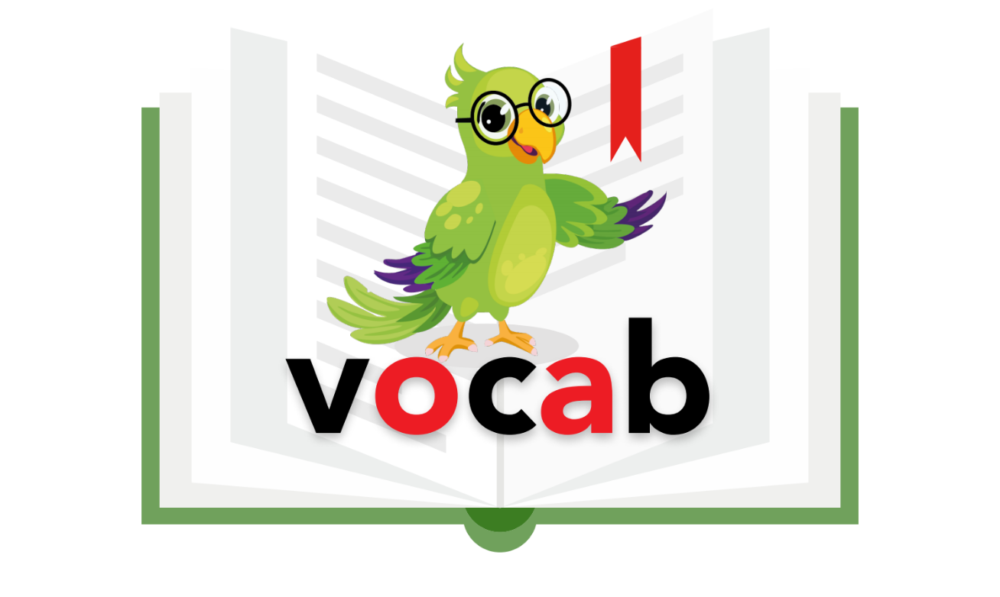
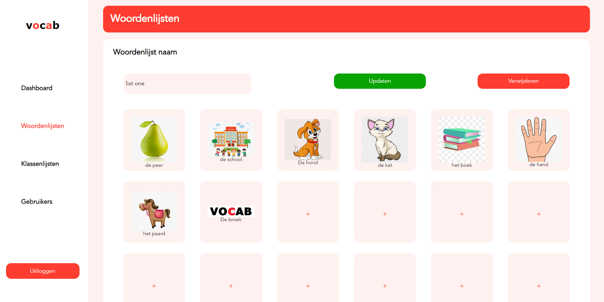
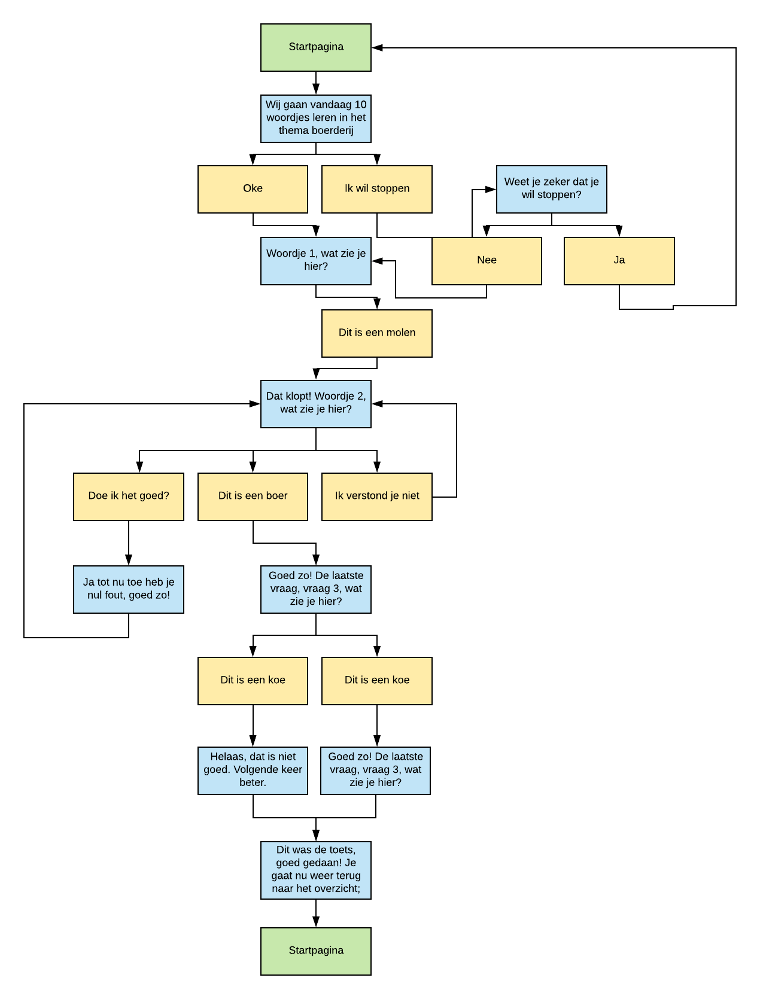
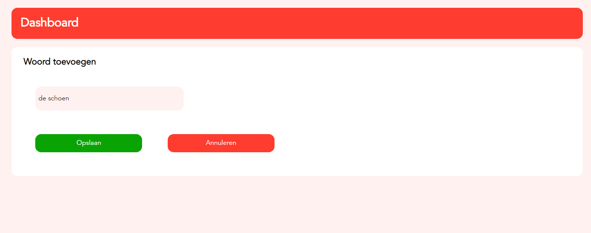
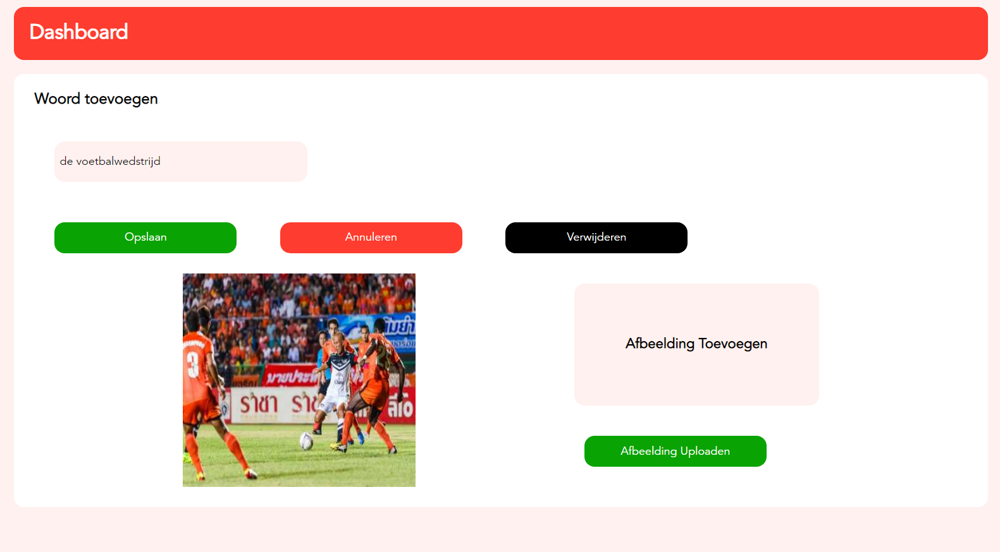
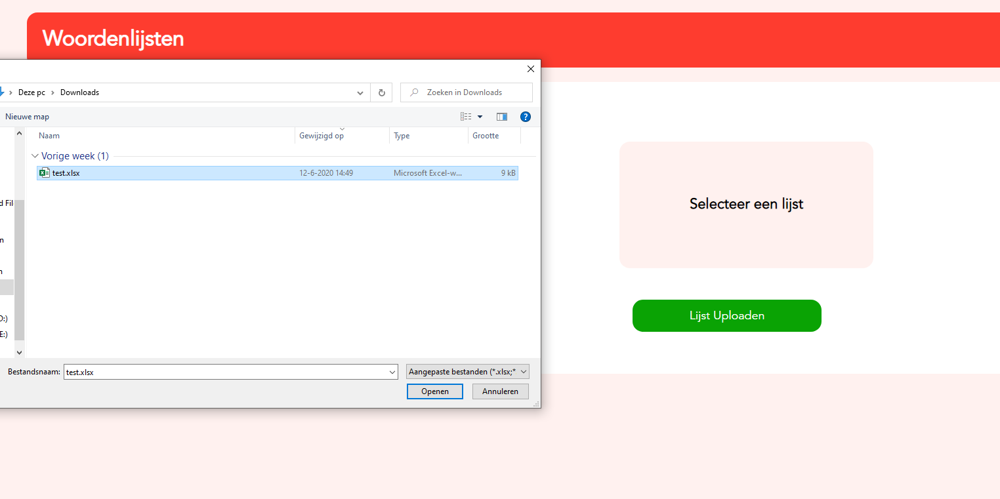
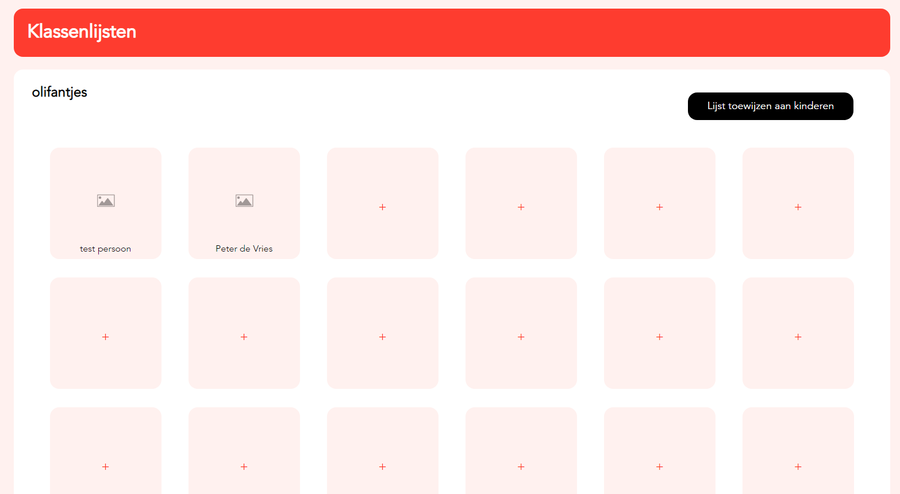
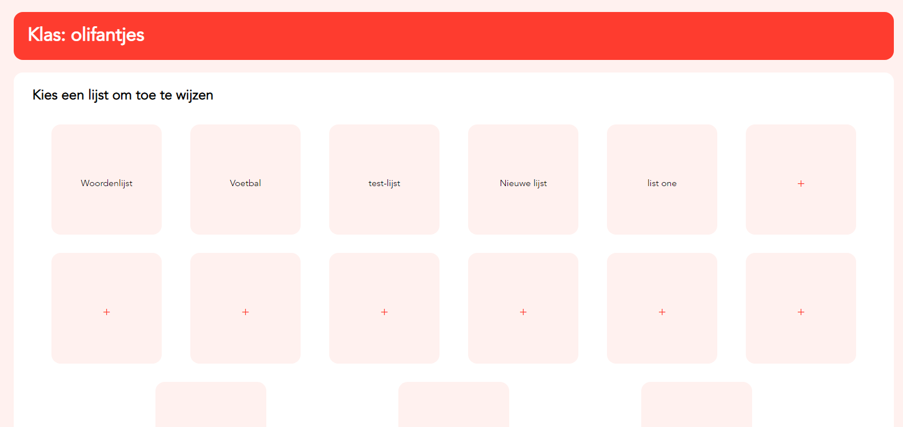
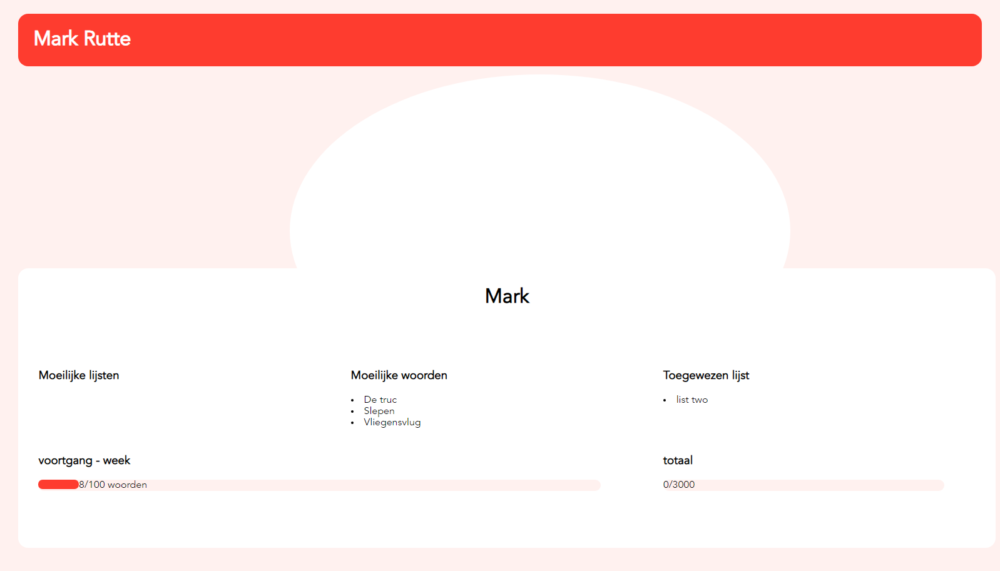

# Vocab





## Table of Contents
- [Installation](#installation)
- [Usage](#usage)
- [Live Version](#live-version)
- [Design Rationale](#design-rationale)
- [Built with](#built-with)
- [License](#license)

## Installation
Clone this repo with your favourite GIT CLI or GUI.  
CD to the root of the project folder.  
Run ` npm install ` to install this project and its necessary dependencies.  
CD to the `functions` folder.
Run ` npm install ` to install the firebase functions and its necessary dependencies.  

## Usage
CD to the root of the project folder.  
Run `firebase serve` and go to `localhost:5000` to see the dev version running.  
For the CMS:  navigate to `localhost:5000/cms`.

## Live Version
Hosting: `https://vocab-project.web.app/` or `https://vocab-project.firebaseapp.com/`  
Navigate to `https://vocab-project.web.app/cms` or `https://vocab-project.firebaseapp.com/cms` for the CMS.

## Design Rationale
Vocab is a concept for a voice user interface which helps students learn Dutch with the help of visual and auditory feedback. This concept has been designed by HvA students from CMD and is backed by a design rationale and research that is also done by the CMD students.

Originally Vocab was designed for NT2 education. NT2 education is special education for children between the ages of 6 years and 11 years which have dutch as a second language. The amount of NT2 children in the Netherlands has increased the last few years. Because School attendance for all children between the ages of 5 and 16 is compulsory, these NT2 children are placed in a newcomer class due to their lack of skill in the Dutch language. The amount of these newcomer classes however are scarce and not every NT2 child can get the sufficient amount of education they need. So Vocab was created to help children increase the grasp with the Dutch language. Due to the Covid-19 pandemic however, the scope of Vocab has been expanded to all children that are learning at home instead of only NT2 children.

To be able to test the concept of Vocab, a working prototype needs to be delivered. With the help of a Design Rationale from the CMD students, this prototype can be built.

### Development Process
<details>
This project has a scrum-like approach. There are five sprints that each last a week. Every monday of the week at 9:30 there is a meeting with out coach (Vasilis van Gemert). At the end of the week we have a kind of sprint review and sprint planning with out product owner (Yuri Westplat). During these end of the week meetings, a demo is shown of the progress that has been made so far.   

These are all participants of this tech side of this project:
- Yuri Westplat (Product Owner)
- Vasilis van Gemert (Coach)
- Students HvA CMD (Design Team)
- Heralt Levant (Developer)
- Tabish Nanhekhan (Developer)
</details>

### Product
<details>
Vocab consists of multiple components. These components are:
   
- Voice Interface
- Content Management System (CMS)

#### Voice Interface

The Voice Interface is made with google conversational actions and this is the part of Vocab that is going to be used by the students. The students are each assigned a word list through the Content Management System by their teachers. These word lists each contain a word that needs to be practiced and an image of a representation of the word in question.

The children can practice words by saying them to the voice interface. Whenever the word is pronounced incorrectly, the word is repeated by the voice interface so the child can try to pronounce the word again. This continues until all the words have been said or when the child stops the exercise prematurely. During the exercise, statistics like mistakes and such are being tracked. These statistics are shown in the Content Management System so the teachers can change the assigned exercises accordingly.

Here is a diagram (in Dutch) for the workflow of the voice interface:   


#### Content Management System (CMS)
The word lists that are used by the Voice Interface should be able to be changed or removed by the teachers of the students. These word lists can be changed with the Content Management System (CMS).

Next to managing word lists, the CMS is also used to manage classrooms and students. Per student there is also a progress tracker, so the teachers know if students are struggling with their assigned exercises. 

Here is a showcase of a few features in the CMS:


*Change word lists*


*Adding a word to a word list*


*Adding an image to a word*


*Upload excel word lists*


*Manage classes and students*


*Assign exercises to students*


*Track student progression*

</details>

### Architecture 
<details>
Vocab is an Node.js express app where we tried to maintain a MVC-like structure.
Vocab is also built with the help of Firebase. Firebase is used for authentication, data persistence, hosting, cloud storage and cloud functions.  

We have implemented the [Repository Pattern](https://docs.microsoft.com/en-us/dotnet/architecture/microservices/microservice-ddd-cqrs-patterns/infrastructure-persistence-layer-design#:~:text=The%20Repository%20pattern,from%20the%20domain%20model%20layer.) for data persistence and to prevent multiple instances of a database connection. These purpose of these repositories is create, read, update or delete data from Firebase. The snippet below is from the wordlists-repository:
```javascript
const firebaseService = require("./db/firebase-service");
const db = firebaseService.db;
const WORDS_COLLECTION_NAME = firebaseService.WORDS_COLLECTION_NAME;
const wordListsCollection = firebaseService.wordListsCollection;

module.exports.getWordLists = () => {
    return new Promise((resolve, reject) => {
        return wordListsCollection.get()
            .then(snapshot => {
                snapshot.docs.forEach(doc => {
                    if (doc.data().name.length === 0) {
                        // Clears empty collection so word lists don't fill up with empty word lists
                        wordListsCollection.doc(doc.id).delete();
                    }
                });
                return resolve(snapshot.docs);
            })
            .catch(reason => {
                return reject(reason);
            });
    });
}
```

Repositories are the only classes that have access to the firebase admin sdk, these repositories are called by their respective controllers. The `getWordLists` function is being called in the wordlists-controller for example: 
```javascript
const repo = require("../../data/wordlists-repository");
const xlsx = require('xlsx');

// Routes to the all the word lists
exports.getWordLists = (req, res) => {
    repo.getWordLists()
        .then(wordLists => {
            res.render("wordlists/wordlists", {title: "CMS", dest: "wordlists", wordLists: wordLists});
        })
        .catch(() => {
            res.render("wordlists/wordlists", {title: "CMS", dest: "wordlists"});
        });
};
```

The purpose of controllers is to retrieve the manipulated data from their respective repository and pass them to the view. The view for the wordlists-controller is `wordlists.ejs`:
```ejs
<%- include ("../partials/head.ejs") %>

<main>
    <h1 class="header">Woordenlijsten</h1>
    <div class="content">
        <h2>Thema's</h2>
        <div class="wordlists-container">
            <% if(typeof (wordLists) != "undefined") { %>
            <% wordLists.forEach(wordlist => { %>
                <a class="square-link" href="word-lists/<%= wordlist.id %>">
                    <button class="wordlist-item"><%= wordlist.data().name %></button>
                </a>
            <% }); %>
            <% } %>

            <% for (var i = 0; i < 53; i++) { %>
                <a class="square-link" href="word-lists/add-list">
                    <button class="wordlist-item add">+</button>
                </a>
            <% } %>
        </div>
    </div>
</main>

<%- include ("../partials/footer.ejs") %>
```
The `wordlists` variable above is from the wordlists-controller. The view is generated with help of the [EJS](https://ejs.co/) templating engine. All the code snippets above form the basis of the mvc-like architecture in Vocab.

</details>

<!---
## Components
<details>
<summary>Dialogflow intents</summary>
The logic for the catching the spoken words of the user when using the app and doing something with it, is in the functions/dialogFlowApp folder. This file contains the intents(chunks of code that correspond to certain things a user says) and the responses that the user hears. This file is a mess, I want to keep the responses that the user hears and the logic for doing certain checks seperate. This will improve the readability.
</details>
-->

## Built With
- [Firebase](https://firebase.google.com/): A comprehensive app development platform built on Google infrastructure.
- [Google Conversational Actions](https://developers.google.com/assistant/conversational/overview): Custom experiences, or conversations, for users of Google Assistant.
- [Dialogflow](https://dialogflow.com/): Platform for engaging voice and text-based conversational interfaces with natural language processing.
- [Node.js](https://nodejs.org/en/): A JavaScript runtime built on Chrome's V8 JavaScript engine.
- [Express.js](https://expressjs.com/): A minimal and flexible Node.js web application framework.
- [EJS](https://ejs.co/): Embedded JavaScript templating.
- [Ngrok](https://ngrok.com/): ngrok tunnels websocket connections over HTTP tunnels.

## License
[MIT](https://choosealicense.com/licenses/mit/)
